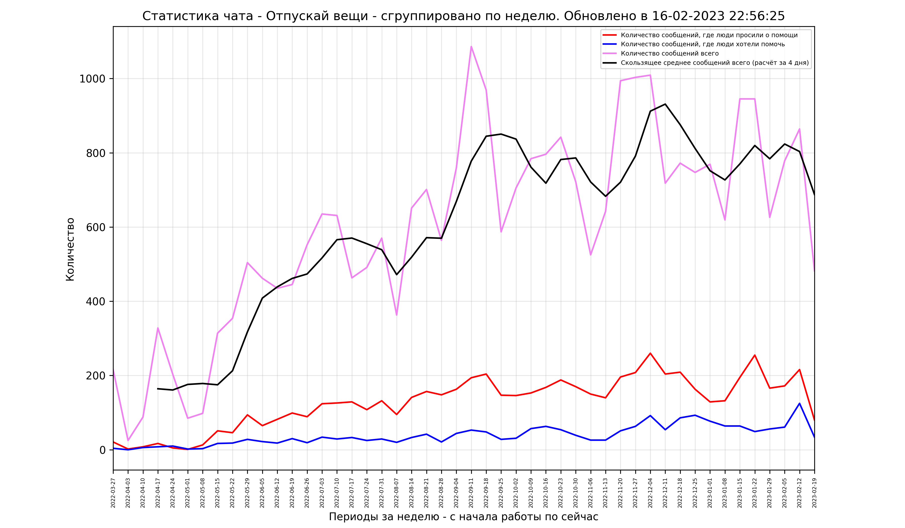

# Analysis chats telegram 
В проекте реализована возможность аналитики открытых чатов Telegram. Сервисы вроде tgstat.ru не включают в свой анализ небольшие чаты, поэтому возникла потребность в такой программе.

Входные данные можно загружать в двух режимах.
1. Экспортировать автоматически с помощью api telegram - библиотека telethon.
2. Экспортировать через интерфейс Телеграм историю переписки и загрузить в рабочий каталог.

Есть возможность добавлять графики на анализе слов regex и группировать по периодам groupby.

На выходе формируется датафрейм, по его данным строится двумерный график с добавлением столбчатой диаграммы за период:
- количество сообщений 
- скользящее среднее 
- количество сообщений с упоминием требуемой 
- количество вступивших участников (вариативно).  




## Установка
```
git clone https://github.com/ghiraphi/Analysis_chats_telegram.git
pip install json
pip install os
pip install telethon
pip install datetime
pip install pandas
pip install re
pip install matplotlib
pip install pathlib
pip install bs4
python run.py
```
